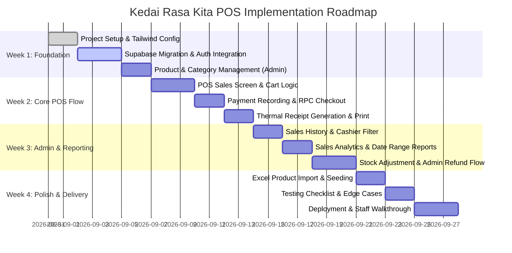

# Implementation Plan: Kedai Rasa Kita POS System

## Tech Stack & Architecture

| Layer | Technology | Rationale & Details |
|---|---|---|
| **Frontend** | React (Vite) + Tailwind CSS | Fast SPA execution, cashier-friendly warm cream & orange theme (`cream-50`, `brand-500`, `brand-900`) |
| **Backend & DB** | Supabase (PostgreSQL + Auth + RLS) | Managed database, real-time sync, built-in Auth, Row Level Security (RLS) policies |
| **Atomic Operations** | PostgreSQL Stored Procedures (RPC) | `process_checkout` RPC function guarantees atomic transaction creation + stock decrement |
| **Auth & Security** | Supabase Auth (JWT + RLS) | Role-based permissions (`admin` vs `cashier`) enforced directly at database level |
| **Receipt Printing** | Thermal Printer CSS (`@media print`) | Native browser printing for 80mm thermal receipt format |
| **Hosting** | Vercel / Netlify + Supabase Cloud | Free/cheap tier deployment accessible from store tablet/laptop and owner's home |
| **Backups** | Supabase Cloud Daily Backups | Automated Point-in-Time recovery & daily database snapshots |

---

## Detailed Database Schema

```
+------------------+       +------------------+       +------------------+
|     profiles     |       |    categories    |       |     products     |
+------------------+       +------------------+       +------------------+
| id (UUID, PK)    |<-----+| id (PK)          |<-----+| id (PK)          |
| name             |       | name             |       | sku (UNIQUE)     |
| role             |       +------------------+       | name             |
| is_active        |                                  | category_id (FK) |
+------------------+                                  | price            |
         ^                                            | stock_qty        |
         |                                            | is_active        |
         |                                            +------------------+
         |                                                     ^
+------------------+       +------------------+                |
|      sales       |       |    sale_items    |                |
+------------------+       +------------------+                |
| id (PK)          |<-----+| id (PK)          |                |
| receipt_number   |       | sale_id (FK)     |                |
| cashier_id (FK)  |       | product_id (FK)  |----------------+
| total_amount     |       | product_name     |
| payment_method   |       | qty              |       +------------------+
| status           |       | price_at_sale    |       |    stock_logs    |
| created_at       |       +------------------+       +------------------+
+------------------+                                  | id (PK)          |
                                                      | product_id (FK)  |
                                                      | change_qty       |
                                                      | reason           |
                                                      | created_at       |
                                                      +------------------+
```

### Table Definitions & Business Rules
1. **`profiles`**
   - Linked 1:1 to `auth.users.id`.
   - Attributes: `id`, `name`, `role` (`admin` | `cashier`), `is_active` (boolean).
   - RLS: Cashiers can view own profile; Admins can view/manage all profiles.
2. **`categories`**
   - Attributes: `id`, `name`, `created_at`.
3. **`products`**
   - Attributes: `id`, `sku`, `name`, `category_id`, `price`, `stock_qty`, `is_active`, `created_at`.
   - Business Rule: Cashiers have read-only access. Only Admin can insert/update price & stock.
4. **`sales`**
   - Attributes: `id`, `receipt_number` (formatted e.g. `KRK-20260831-0001`), `cashier_id`, `total_amount`, `payment_method` (`cash`, `qris`, `debit`, `transfer`), `status` (`completed`, `cancelled`), `created_at`.
   - Business Rule: Refunds/cancellations require admin approval.
5. **`sale_items`**
   - Attributes: `id`, `sale_id`, `product_id`, `product_name` (snapshot), `qty`, `price_at_sale` (snapshot).
6. **`stock_logs`**
   - Attributes: `id`, `product_id`, `change_qty`, `reason` (`sale`, `adjustment`, `refund`), `created_at`.

---

## 4-Week Implementation Plan



### Week 1 — Foundation & Auth Infrastructure
- [x] React (Vite) + Tailwind CSS base configuration with brand colors.
- [x] Initialized Supabase client and defined `supabase/schema.sql`.
- [x] Deploy schema to Supabase Cloud & set up RLS security policies.
- [x] Implement Login Screen with Supabase Auth & profile role check (`admin`/`cashier`).
- [x] Implement Admin Product & Category CRUD screens.

### Week 2 — Core POS Sales Flow
- [ ] Build cashier-focused POS Screen with category filter & search.
- [ ] Implement interactive Cart panel (add item, qty counter, subtotals).
- [ ] Implement Payment Modal (Cash, QRIS, Debit Card, Bank Transfer).
- [ ] Wire `process_checkout` RPC for atomic checkout & instant stock auto-decrement.
- [ ] Build thermal printer receipt component (`@media print` CSS, 80mm format).

### Week 3 — Admin Reporting & Stock Tools
- [ ] Sales History View: Cashiers view their own transactions; Admin views all transactions.
- [ ] Sales Reports Dashboard: Daily/Weekly/Monthly totals, payment method breakdown, date range filters.
- [ ] Manual Stock Adjustment Interface (Admin only) with mandatory log reasons (`adjustment`).
- [ ] Refund / Transaction Cancellation flow with mandatory Admin approval prompt.
- [ ] Cashier Account Management (Admin can create/deactivate staff logins).

### Week 4 — Migration, Backups & Delivery
- [ ] Import client's existing Excel menu catalog into `products` table.
- [ ] Configure Supabase Cloud automated database backups.
- [ ] Run full **Definition of Done** testing checklist (edge cases, out-of-stock validation, RLS security check).
- [ ] Deploy frontend to Vercel/Netlify.
- [ ] Conduct staff walkthrough & Client Revision Round 1.

---

## Testing & Definition of Done Checklist

- [ ] **Daily Workflow Validation**: Full run-through (`Login → Sell → Payment → Checkout → Stock Update → Receipt → History`).
- [ ] **Permission Locks**: Verify cashier account cannot edit prices, manually adjust stock, view global reports, or deactivate accounts.
- [ ] **Stock Atomic Integrity**: Verify stock cannot drop below zero when simultaneous checkouts occur.
- [ ] **Receipt Accuracy**: Verify 80mm receipt prints cleanly on thermal hardware.
- [ ] **Remote Access**: Confirm application loads seamlessly from both store network & remote home network.